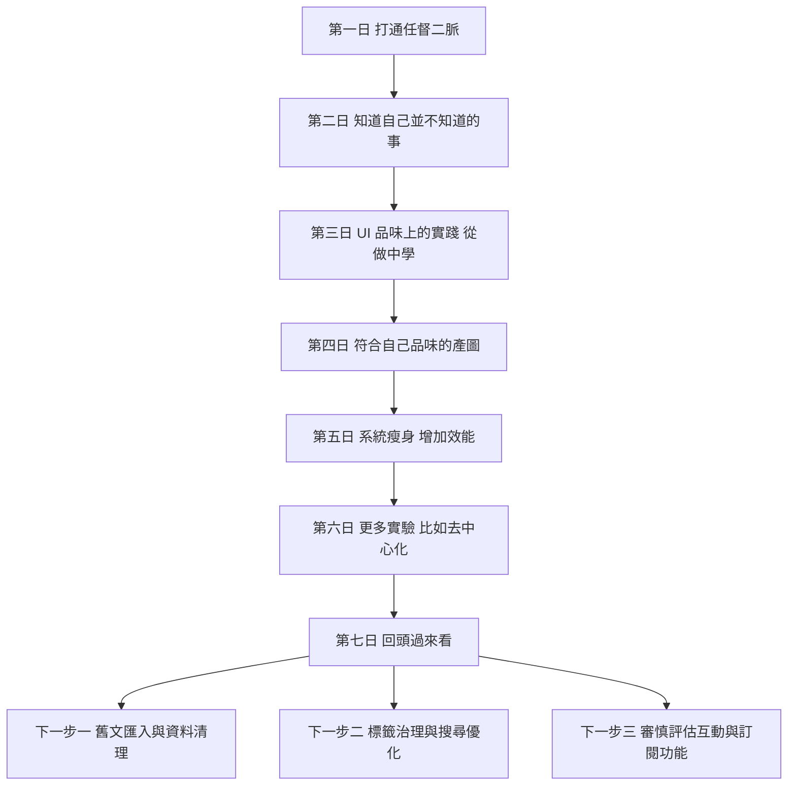

這篇文章是第一次使用口語進行騰打，再透過 GPT-5.3-Codex 修飾，閱讀上與我自己寫文的風格有點差異，不過作為日記記錄，感覺挺好的，先繼續這樣實驗下去。

## 第一日 打通任督二脈

我以前一直想把自己的部落格做好，但每一次真正要上線時，總會卡在 GitHub Pages 和網域設定這一段，Cloudflare 看起來只是幾個欄位，實際上只要其中一個細節偏掉，整個流程就會失靈，然後我就會在還沒開始寫內容前先被技術磨掉耐心。
這次我做了一個關鍵改變，我先把我要的目標與感覺說出來，再讓 Codex 幫我把技術路徑拆開，於是我第一次在幾乎不寫程式的狀態下把網站搭起來，第一次感受到用自然語言也能把一個系統真正推動起來。

## 第二日 知道自己並不知道的事

我原本以為先有網站比選對框架更重要，於是很快用上 Jekyll，但隨著內容變多與設計要求提高，整體限制開始明顯，尤其當我把閱讀體驗和畫面秩序放在第一順位時，調整成本變得很高。
那一天我真正學到的，不只是換到 Astro 這個工具選擇，而是我開始能更準確辨識自己的需求，從一開始不知道問題在哪裡，到後來知道哪裡不對，再到最後能清楚定義我要什麼，這種後設認知讓後面的每一步都更穩。

## 第三日 UI 品味上的實踐 從做中學

我花了最多時間調整的不是炫目的互動，而是讀者真正會碰到的行為路徑。
聚焦閱讀最初的按鈕放在上方，看起來合理，實際閱讀卻不順，讀到一半想切換得拉回去很遠，這個摩擦會破壞閱讀節奏。
後來我把它移到頁面底端，並讓文章預設進入聚焦狀態，讀者隨時都能切換回一般模式，這樣我也才能把分享、推薦、打賞、數位簽章等功能放在一般模式裡，不去干擾主閱讀面。

## 第四日 符合自己品味的產圖

我的文章題材偏抽象，圖片若只是一次次碰運氣，結果常常不準，甚至會讓首頁看起來像不同網站拼在一起。
我把提示詞拆成幾個固定變數，包含色系、情境氛圍、角色元素，再讓文章關鍵字驅動這些變數，讓圖片結果與內容產生關聯，最後再做壓縮與尺寸控制，避免首頁速度被大圖拖慢。
這一步表面上像視覺設計，實際上同時也是效能工程與內容工程，因為它影響首屏體感，也影響讀者願不願意繼續往下讀。

## 第五日 系統瘦身 增加效能

功能一多，最容易發生的事情就是新功能壓壞舊功能，所以我開始把系統裡不用的路徑和負擔清掉，整理腳本與資料結構，控制輸出範圍，縮小不必要的索引負載。
這讓我更確定一件事，網站不是功能越多越完整，而是每次新增都要回答一個問題，這個改動到底有沒有讓閱讀更順。
當這條原則建立起來之後，迭代反而更快，因為每次決策都有一致標準。

## 第六日 更多實驗 比如去中心化

我開始嘗試把內容放進 ENS 與 IPFS IPNS 這條路，目標是讓文章有更抗審查的分發備援。
過程裡錯誤很多，從額度限制到部署流程中斷幾乎都遇過，但這種邊做邊修讓我更清楚目前邊界在哪裡。
我現在刻意維持全靜態架構，先不接訂閱金流資料庫，因為我希望先把閱讀體驗與內容治理打穩，再決定下一步要不要往後端擴張。

## 第七日 回頭過來看

這一週最重要的成果其實不是頁面變漂亮或功能變多，而是我終於建立一套可以長期運作的方式。
我把技術問題變成可對話的需求，把需求變成可驗證的改動，再把改動變成可維護的系統。
下一個最重的任務會是匯入過去大量社群文章，並且維持介面清楚、搜尋可用、標籤有秩序，讓讀者在內容很多的情況下仍然能快速找到值得看的東西。

## 變化流程圖

