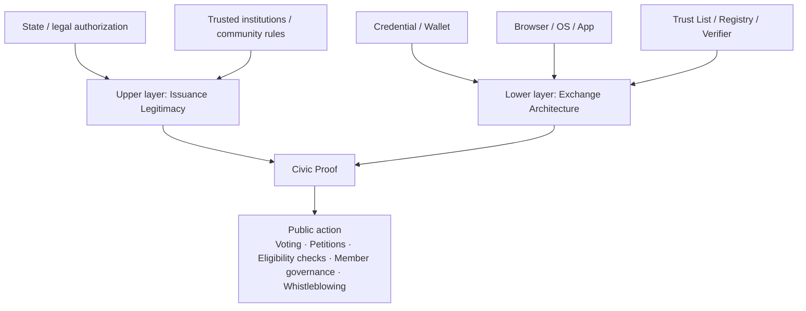
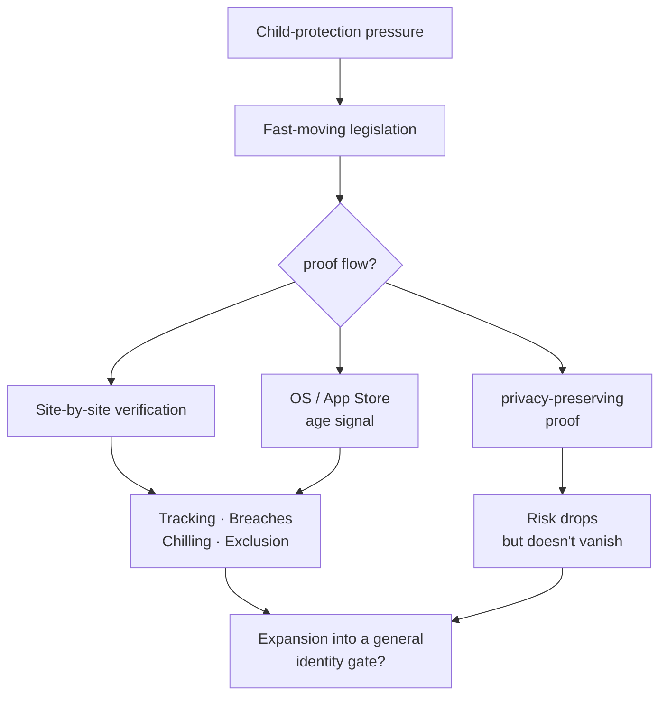
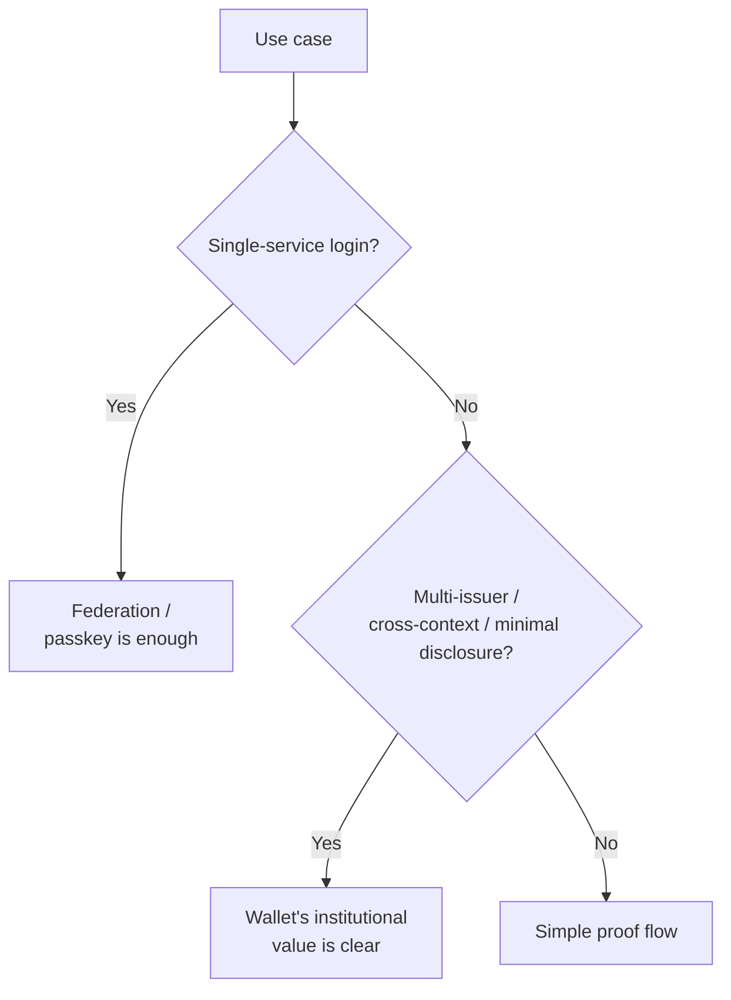
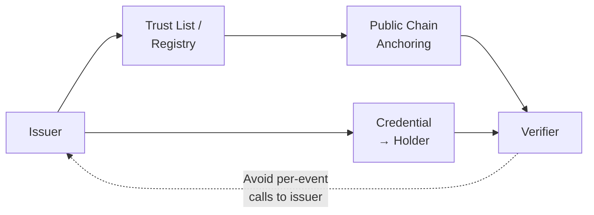

> Presentation slides: [中文版](https://mashbean.net/blog/allen-lab-share-0417-zh/) ｜ [English](https://mashbean.net/blog/allen-lab-share-0417-en/)

At our last Allen Lab meeting, Jeremy McKey gave everyone a way into Digital Public Infrastructure (DPI) through the lens of payment. Today I want to add another piece of the puzzle: identity. If we use the common three-part framing of DPI, the conversation usually lands on Data, Payment, and Identity. Allen Lab has already built up a lot of material on Data, including many cases of how open data strengthens civic action, so today I want to fill in the last piece — digital identity.

I've spent about half of the past year inside this topic. For two and a half years I worked at Taiwan's Ministry of Digital Affairs on the planning and rollout of the digital wallet. After leaving government in the middle of last year, I kept doing policy research on digital identity and joined experiments in civic settings — piloting Zero-Knowledge Proofs (ZKP), helping open community platforms think through identity integration, and exploring how to build verifiable qualifications without revealing full identity. At the same time, because of another line of my work, I've been paying close attention to how dispersed and exile communities adopt emerging technologies. I originally thought this would be a digital democracy topic. What I found instead was that the same issue kept coming up over and over again: digital identity. In Eastern Europe, in Catalonia, and in city-level democratic experiments, people keep running into the same question: how do you prove "sufficient standing" in digital space without handing yourself over to the state, a platform, or any single intermediary?

What really helped me connect these materials was encountering the concept of Digital Civic Infrastructure (DCI) after coming to Allen Lab. I started realizing that what I actually care about is bigger than whether large state projects can be institutionalized, and bigger than whether commercial services can integrate identity in a stable way. The deeper question is whether digital identity can become a piece of infrastructure that supports civic action — helping people connect, understand, and act, while avoiding over-disclosure, over-tracking, and over-exclusion. Danielle Allen and the Allen Lab frame DCI as the [institutional and technical conditions](https://ash.harvard.edu/resources/a-framework-for-digital-civic-infrastructure/) that let citizens **Connect, Learn, and Act**. My core concern is therefore how digital identity determines whether someone can move from connection to action.

I've long felt that digital tools already have plenty of success stories at the stage of what we might call digital assembly — in some countries, digital assembly has even played an important role in regime change. But digital association still doesn't have many strong examples. My hypothesis is that a big reason is the weak foundation underneath it: digital identity. This is a hypothesis I haven't proven empirically, but my inference is that digital identity is still not private enough. Because of that, forms of secret association built on digital identity have never really become workable — let alone effective digital activism.

So this essay focuses on a narrower and more political question: what kind of digital identity architecture would let citizens act in digital space with low friction, low exposure, and real avenues for redress? Simply moving credentials onto a phone is, to me, just the inevitable product-level outcome of digital identity policy — the domain of public service digitization. The deeper issues touch state power, platform responsibility, civil liberty, cross-border interoperability, and the conditions for entering public space. That is why I want to put identity back into the DCI frame.

## Why Digital Civic Infrastructure Must Talk About Digital Identity

If we think of DCI as a stack of institutions that lets citizens connect, understand, and act, then the most sensitive position for digital identity appears the moment a system starts to gate action.

At the **Connect** layer, identity mostly handles persistence, community governance, role allocation, and basic trust — who is who in a community, who can be an administrator, who can maintain a long-term contribution record. My experience participating in g0v — Taiwan's largest civic tech community — is that open-source collaborative communities don't really have a gating problem, because trust between people is built through long-term contribution. The relevant terms are "do-ocracy," "trust through contribution," or the IETF's "rough consensus and running code." In such civic action communities, strong contributors can even be anonymous; digital identity is only a symbolic trust anchor and involves no digital service at all. There have been many projects trying to record open-source contribution (such as Web3's Hypercerts), but most failed — perhaps because no quantitative metric can substitute for the social capital a community accumulates naturally.

At the **Learn** layer, a lot of information access and discussion does not require strong identity either. Reading without login, low-threshold participation in discussion, or weak-tie participation usually still works.

The real political pressure lands on **Act**. The moment a system asks whether you are qualified, whether you are voting twice, whether you belong to a certain geography, whether you meet an age threshold, whether your participation follows procedure, or whether you must be accountable for an outcome, digital identity moves into the core of public decision-making. From that point on, identity is no longer just a login detail. It directly participates in the distribution of public resources, the conditions for entering public space, and the legitimacy structure of digital public life. The DCI framework treats Connect, Learn, and Act as interlocking entry points of civic participation; my observation is that identity intervenes most strongly in Act — because action can border on public services, including whistleblowing, voting, petition endorsement, standing for election, and long-term associational governance.

I want to put forward three propositions to carry the argument. First, mainstream digital identity systems are already quite successful, especially in service delivery, authentication, signatures, compliance, and fraud reduction. Second, once identity infrastructure moves into age verification, platform governance, and the entrance to public space, it starts deciding who can enter which spaces and under what conditions. Third, the maturation of wallets, selective disclosure, unlinkability, Zero-Knowledge proofs, and browser APIs means that more democratic digital identity design has, for the first time, entered the feasible zone at the policy and product level — but institutional governance is clearly lagging behind what the technology now makes possible.

## From Digital Identity to Civic Proof

**Accountability does not require real-name identity.**

I suggest splitting digital identity into two layers before discussing it. The first layer is **issuance legitimacy**: who has the authority to issue a credential that carries civic consequences? This layer is about legal effect, sovereignty, institutional accountability, revocation authority, and why a credential deserves to be trusted in the first place. The second layer is **exchange architecture**: how credentials are held, how they are presented, who verifies them, how they are revoked, how they get reused across systems, and whether the whole process leaves a trackable trail. The first is institutional, the second technical, but they are tightly coupled. Once you separate these two layers, a lot of debates that usually get mixed together become much clearer. PKI, Verifiable Credentials (VC), wallets, browsers, trust lists, and trust registries all operate at different layers.

The following diagram shows how the two layers converge into civic proof, which then supports concrete public action:

I want to introduce a term: **civic proof**. The point of this term is to move the focus away from the credential itself and toward the form of proof that can actually support public action. In many cases, civic action does not require full legal identity. What it may need is only an **attribute proof** — proving you are over 18, or that you live in a certain jurisdiction. It may only need a **uniqueness proof** — one person one vote, one person one account, resisting Sybil attacks without knowing your real name. Moving into politically sensitive settings, there is also **pseudonymous participation** — you must be able to participate, speak, contribute, and be audited afterward, without exposing your real identity under ordinary conditions. If we do not separate these four needs first, every later debate about citizens using digital identity in public affairs gets muddy.

Normatively, I use four conditions to evaluate a system, checking whether they hold across different needs, institutional designs, and architectures: **anonymity**, **unlinkability**, **verifiability**, and **accountability**.

The table below organizes the four types of civic proof and what each demands from the two layers:

| Type of need | Typical scenarios | What the upper layer must provide | What the lower layer must provide | Minimum bar for liberty & privacy |
|---|---|---|---|---|
| **Legal Identity** | Tax filing, legally binding signatures, statutory benefits | State- or law-authorized root identity | High assurance, revocable, actionable | Verifiable, redressable |
| **Attribute Proof** | Age, residency, student status, membership | Verifiable attribute source | Selective disclosure, minimal disclosure | Unlinkable, no phone-home |
| **Uniqueness Proof** | One person one account, one person one vote, forum blue checks | Trustable source of uniqueness | Deduplication, Sybil resistance, low disclosure | Pseudonymous, unlinkable |
| **Pseudonymous Participation** | Whistleblowing, sensitive consultation, political discussion | Procedural legitimacy and ex-post accountability | Preserve anonymity, preserve auditability | Anonymous, accountable, supervised |

These four conditions must hold at the same time; they cannot substitute for one another. Across the new-generation identity projects I've participated in, I found one counter-intuitive state that is nonetheless self-consistent in cryptography (or political philosophy?): **accountability does not require real-name identity as its precondition.** That sentence runs through everything that follows — because many problems long assumed to be solvable only by full personal-data disclosure (full identification) suddenly gain new institutional room.

## Comparing National Credential Issuance

Looking from the upper layer of issuance legitimacy, high-assurance trust roots for digital identity today still mostly come from the state, or from institutions the state recognizes. That has not really changed. Self-issued identity (like an Ethereum address), civil-society-issued identity (union membership, clubs, associations), and company-issued identity (like Gmail) generally cannot satisfy the needs of legal proof or attribute proof. On uniqueness proof and pseudonymous participation, experimental projects have appeared (such as Gitcoin Passport in Web3, since sold off and redirected), but these experiments ultimately anchor on state-issued documents (as zkPassport does). I think the main reason is that people — even other countries' people — still trust the identity-issuing power of sovereign states more.

What has really started to diverge over the last decade is the lower layer, the exchange architecture: how credentials are held, how they are presented, who gets to verify, who can join the ecosystem, who controls the trust list, and who bears the onboarding cost. Differences at this layer directly change whether digital identity can reach the Act layer of DCI. The historical trigger was COVID-19. Vaccine passports carried highly sensitive personal data, and different standards bodies began proposing "decentralized identity" as a response to the centralized government identity databases and their surveillance risks. This field later produced Verifiable Credentials, Decentralized Identifiers (DID), and applications of Zero-Knowledge proofs.

Three main comparisons:

| | Upper layer: issuance legitimacy | Lower layer: exchange architecture | Current strength | DCI gap |
|---|---|---|---|---|
| 🇹🇼 **Taiwan** | MOICA has legal effect; TW DIW multi-issuer ecosystem | PKI + wallet / VC dual track | Clear legal effect, rising policy flexibility | Ecosystem onboarding friction and civic burden coexist |
| 🇪🇺 **EU** | eIDAS trust services, national trusted lists | EUDI Wallet, attestation, selective disclosure | Complete legal framework, formal cross-border interop | Complex rules; wallet / browser become new gatekeepers |
| 🇸🇪 **Sweden** | Commercial BankID as de facto infrastructure; government catching up | High everyday adoption, mature platformization | High frequency of use, deep social penetration | Dependence on a single commercial operator, inclusion risk |
| 🇺🇸 **US** | State-level mDL, state laws, state wallets | Mature standards, fragmented deployment | Strong OS and market influence | Fragmented national institutions, large interstate variance |

**Taiwan** simultaneously has MOICA — a high-assurance, strong-legal-effect, issuer-centric path — and TW DIW, a wallet path moving toward multiple issuers, scenario-based presentation, and selective disclosure.

**The EU**'s upper layer is still eIDAS trust services and national trusted lists, while the lower layer is integrated by the EUDI Wallet: attestation, wallet holding, user consent, and cross-border presentation.

**Sweden** is most interesting because society depends heavily on the commercial BankID, with its risk of corporate monopoly; the central bank has publicly argued that government eID should become an important complement. It shows that a commercial identity system can penetrate social life very deeply, but public governance concerns do not disappear because the operator is private.

Additional reference points:

| | Upper layer: issuance legitimacy | Lower layer: exchange architecture | Current strength | DCI gap |
|---|---|---|---|---|
| **[MOSIP](https://mosip.io/)** | Modular identity infrastructure each country builds itself | Open source, modular, locally deployable | Cost and sovereignty appeal for many countries | Whether it supports civic rights depends on each country's governance |
| 🇮🇳 **Aadhaar** | Massive national-scale root identity | Authentication / eKYC oriented | Enormous scale and coverage | High scale ≠ high protection of freedom |
| 🇧🇹 **Bhutan NDI** | Sovereign-backed National Digital Identity | Trusted wallet, VC oriented | National-level innovation direction | International interop and governance maturity still forming |

Looking further out: the US is not a single path but a cluster of state-level and market-platform tracks — California's OpenCred and wallet ecosystem, and Utah's digital identity rights language, are both worth watching. MOSIP, oriented toward the Global South, offers a modular, open-source model of infrastructure a state can own itself. India's Aadhaar reminds us that massive verification scale and coverage are not the same as civic-freedom-first. Bhutan's value is that its sovereign-backed NDI path has already put a trusted wallet and verifiable credentials into a national-level direction — a high-signal case to keep watching.

Around the world, the focus of competition has expanded from "who has the power to issue identity" to "who controls the trust list, who controls the presentation interface, and who bears verifier onboarding and ecosystem cost." The key to digital identity entering DCI is not whether a trust root exists — it is what kind of exchange architecture operates that trust root.

## Taiwan's Citizen Digital Certificate (MOICA) and Digital Identity Wallet (TW DIW)

Taiwan's two policy cases deserve a direct comparison, because together they contain both a warning case and a civic-tech testbed.

MOICA is Taiwan's Citizen Digital Certificate — a traditional PKI smart card, later extended with a mobile application service. It provides high assurance under the Electronic Signatures Act, clear legal effect, and relatively clear integration into government processes. For many government-led digital public services, that matters a great deal.

In 2020 the government even tried to merge MOICA with the paper national ID card, in a project called New eID, but [ran into massive public backlash](https://mashbean.net/facebook/2026/0103-miefwt/): the prevailing view was that New eID lacked legal authorization and carried cybersecurity risks, so it was suspended. New eID still is not moving forward and has become a frozen project inside government.

Seen through the DCI framework, the core problem with MOICA is not the PKI, nor the credential itself. The real problems are the onboarding friction of an open ecosystem: application eligibility, in-person counter procedures, third-party integration cost, and an overall system that is highly issuer-centric. MOICA's official identity-confirmation service explicitly requires application systems to apply and be approved before gaining access. This design suits highly controlled, highly accountable scenarios — but for third-party civic services, the friction is very high.

TW DIW takes a different path. Its official direction is not to issue another centralized national digital identity, but to turn existing government and private-sector credentials into digital credential cards the holder can manage. TW DIW open-sourced its issuer and verifier modules earlier, and today (2026-04-17) open-sourced the mobile application code as well — an important milestone. Telecom SIM credentials are already supported for picking up e-commerce packages at convenience stores; business certificates and driver's licenses should follow.

TW DIW's policy design emphasizes selective disclosure, interoperability, an open ecosystem, and the possibility of multiple issuers and verifiers. From a DCI perspective this gives it real potential, because much of civic action needs not tightly controlled central identity management, but more convenient, more composable, lower-disclosure proof.

Still, the civic-tech question TW DIW raises — how citizens use a digital wallet to strengthen action — cannot be understood merely as an adoption threshold. More precisely, it involves a **redistribution of civic burden**. Because DIW can host digital identities issued by many institutions, multiple trust roots, multiple trust lists, and plural issuers expand the ecosystem's possibilities — but they also shift the costs of understanding, consent, verification, appeal, and responsibility allocation onto citizens and verifiers.

The comparison table below summarizes the two systems' key differences from a DCI perspective:

| Dimension | MOICA (Citizen Digital Certificate) | TW DIW (Digital Identity Wallet) |
|---|---|---|
| **Design center** | Issuer, statutory effect, identification, e-signature | Holder, credential cards reused across scenarios |
| **Typical tasks** | Identification, digital signature, encryption | Attribute presentation, cross-scenario credentials, selective disclosure |
| **Third-party integration** | Formal application, review, approval | More open sandbox, wider issuer / verifier entry |
| **Disclosure logic** | High-strength confirmation, even full identification | Scenario-based consent and minimal disclosure |
| **Main friction** | Counters, eligibility, API review, onboarding cost | User understanding, verifier integration, trust-list governance |
| **DCI lesson** | Strong credentials suffice for government processes, not necessarily for civic action | More application space, but civic burden spreads to citizens and verifiers |

MOICA's friction concentrates before entry — application, review, onboarding. TW DIW's friction concentrates inside ecosystem operation — how you understand the credential in your hand, whether you trust its issuer, how a verifier verifies, and who is responsible when a dispute arises. This matters for DCI because civic infrastructure is not just about whether the technology runs; it includes the entire allocation of usage and accountability costs.

Two live cases show how the civic tech community is using these existing public services for civic action.

### Case A: PTT's Anonymous Residency Proof via MOICA

PTT, Taiwan's largest BBS, still has hundreds of thousands of users, but the platform has long suffered from coordinated behavior and troll armies before elections — something volunteer moderators can hardly solve with traditional content moderation. This year (2026) is Taiwan's local election year, and the engineering team used MOICA to generate Zero-Knowledge proofs, letting users get a "blue check" without revealing their real identity, reducing the frequency of troll attacks. This proves that a state root credential can provide the trust root without handing full identity to the platform — and without the platform knowing exactly who you are. That is a concrete path from a state credential to a civic proof.

### Case B: g0v Summit Issues Entry Passes via the Digital Wallet

An equally important direction is g0v Summit 2026. g0v is Taiwan's largest civic tech community and holds its summit every two years. This year the volunteer team will use the digital wallet to issue credentials and entry passes, with non-government third parties acting as issuer and verifier. This directly proves that a holder-centric ecosystem does not have to be operated by government alone — civic communities, event organizers, and unofficial verifiers can operate within the trust framework. It forms a neat contrast with the PTT case: the former uses a strong state credential to produce a low-disclosure civic proof; the latter uses the wallet architecture to expand the practical space for non-government issuance and verification.

## Age Verification Is the Best Stress Test for National Digital Identity Policy

I think age verification slides easily from child protection into generalized access control. That is why age verification is the most charged part of "digital identity as public infrastructure." It pushes identity infrastructure, which used to sit in the back office, right up to the entrance of public space and the speech arena. When a person must present an age proof before entering a service, a discussion space, a category of content, or a form of social interaction, identity has formally entered the conditions for entering public space.

This wave of age-verification legislation is clearly moving faster than technical standards and human-rights assessment. Before ISO/IEC 27566-1 — the first international age assurance standard — was published in December 2025, multiple US states had already legislated, the UK had begun enforcement, and Australia's law had taken effect. More importantly, the standard itself states plainly that the goal of age assurance is an age-related eligibility determination, and that obtaining age assurance does not necessarily require establishing a person's full identity.

The table below summarizes regulatory motion in four major jurisdictions:

| | Regulatory motion | Key timing | Core tension |
|---|---|---|---|
| 🇬🇧 **UK** | Ofcom requires highly effective age assurance, allows multiple technical paths | From 2025-07, porn sites need strong age checks | High regulatory intensity, inconsistent privacy standards |
| 🇦🇺 **Australia** | Social media minimum age, platforms must take reasonable steps | Effective 2025-12, compliance update 2026-03 | Platform liability, effectiveness, wrongful blocking |
| 🇪🇺 **EU** | Age verification app / blueprint joined to the EUDI track | 2025 blueprint, deployable 2026-04 | Whether minimal disclosure can be institutionalized |
| 🇺🇸 **US** | From state-level content gates toward device / OS / app-store age signals | 2025-06 Paxton; 2025-10 CA AB1043 | Sliding from a "porn threshold" to "infrastructure-layer age signals" |

The UK, Australia, and the EU give three mature but different comparison paths. Ofcom's model is high regulatory intensity plus technology neutrality: age assurance must be technically accurate, robust, reliable, and fair, with listed methods including open banking, photo-ID matching, facial age estimation, mobile-network-operator checks, credit card checks, digital identity services, and email-based age estimation. The upside is flexibility; the downside is that platforms will pick the cheapest, easiest-to-deploy option — which is not necessarily the most privacy-friendly. Australia leans harder on platform liability and post-implementation supervision: after the law took effect on December 10, 2025, eSafety issued a compliance update in March 2026, continuing to review whether platforms took sufficient reasonable steps. The EU's direction tries to institutionalize "prove only that you are over 18": in April 2026 the Commission announced its age verification app is deployable, initialized with a passport or ID document.

In the US, on June 27, 2025, the Supreme Court ruled six to three in Free Speech Coalition v. Paxton that Texas's adult-content age-verification law is constitutional. The majority opinion states that age proof is an ordinary and appropriate means of enforcing an age limit. This is a key turn, because it converts age verification — long treated as a highly suspect burden on speech — into a more acceptable constitutional instrument, at least in the context of sexual content harmful to minors. The EFF then reminded everyone that the ruling's legal reasoning is limited to sexual content minors had no right to access in the first place, and does not automatically authorize broader age gates on social media, general websites, or app stores. In other words: the legal scope is limited, but the policy momentum did not stop there.

Paxton's legal logic is bounded to specific content, but policy implementation quickly moved further down the stack. California's AB1043, the Digital Age Assurance Act signed in 2025, requires operating system providers to ask the account holder for the user's birth date or age at account setup, and to provide developers an age-bracket signal via a real-time API. More critically, developers must request that signal when an app is downloaded and launched. Age verification is no longer just a content threshold for one class of websites — it is sinking toward devices, operating systems, and app-distribution infrastructure. California's law does include protective clauses, such as transmitting only minimal necessary information and banning anticompetitive use of compliance data. Illinois's proposed Digital Age Assurance Act, though not yet passed, moves along the same line, writing age signals into the device / OS / app store layer. Put these together and the real turning point in the US is clear: not one adult-content ruling, but the move from content gates to infrastructure signals.

I want to add a fifth, hidden question. The first four are familiar: who issues the proof, how much is disclosed, whether it can be tracked, how to seek redress. The deeper one is: will this expand from specific content control into broad identity control? How do we avoid a **structural slippery slope**? California's AB1043 age-signal model, the UK's drift from the Online Safety Act toward broader wallet and digital identity discussions, the EU folding age verification into the EUDI Wallet, and US state laws moving from adult sites to social media and device-level signals — all point the same way: once the infrastructure is built, new policies tend to ride on it.

The impact of age verification runs along at least four dimensions:

| Rights dimension | Risk pattern |
|---|---|
| **Privacy** | Documents, age, biometrics processed centrally |
| **Anonymity** | Lawful browsing collides with the right to anonymity |
| **Free expression** | Adults pushed into self-censorship (chilling effect) |
| **Digital divide** | People without documents / bank accounts excluded |

The following diagram shows the paths age verification can take from child-protection pressure, and their risks:

There is also the security risk of centralized third-party verification vendors. In 2025, Discord admitted that in the incident at its third-party vendor 5CA, government ID photos of roughly 70,000 users submitted for age-related appeals may have been exposed. Add the long list of Tea, AU10TIX, IDMerit incidents. The common thread: once age verification adopts a centralized document-upload and outsourcing model, it becomes a high-value attack target. So this section cannot only discuss constitutional speech burdens; it must also discuss operational security burdens.

Good designs do exist. France's double anonymity, the EU's app plus EUDI track, and Spain's earlier Zero-Knowledge age-verification attempt all show that age verification does not have to mean full identity upload. The EUDI architecture documents state directly that selective disclosure, user approval, tracking prevention, and even a ZK-implemented "I am over 18" are all treated as legitimate directions. For a full policy analysis of age verification, see my [Age Verification and Digital Rights report](https://pro.mashbean.net/reports/2026-04-16-age-verification-digital-rights/).

## From Full Identification to Minimal Proof

Age verification is a very good example of what happens when policy moves before technology.

Age verification is a typical attribute proof, and there are two broad approaches: full identity and minimal proof. The table below contrasts them across question settings:

| Question | Full identity | Minimal proof |
|---|---|---|
| Are you over 18? | Show birth date, full document | Prove only "over 18" |
| Do you live here? | Show full address or household registration | Prove only residency eligibility |
| Are you the same person? | Hand over real name, ID number | Uniqueness proof or pseudonymous credential |
| Do you hold a qualification? | Hand over the whole document | Present only the specific attribute |

At today's level of technical maturity, the issue is no longer whether the technology can do it — it can. The real question is which situations should treat minimal proof as the default. Very often, all we need to know is whether one condition holds: over 18, resident in a certain area, student status, membership. If a system demands full identification every time, it is institutionalizing over-disclosure. Conversely, if proof flows are designed with selective disclosure, unlinkability, and no-phone-home, digital identity has a chance of supporting more democratic governance of public space.

The decision tree below helps judge when a wallet is necessary:

Is a wallet necessary? My answer is conditional. If the need is only single-service login, federation (Sign in with Google), passkeys, or existing high-assurance login tools are often enough. When the need becomes multi-issuer, cross-context reuse, minimal disclosure, user consent, and cross-border interoperability, the wallet's institutional value rises sharply — because the wallet is then not just a container: it carries presentation, consent, credential management, and the composition logic across issuers. NIST folding "subscriber-controlled wallets" into its model (SP 800-63-4) is essentially an acknowledgment of this.

I also want to stress that the presentation layer is being platformized very quickly. Once wallets, operating systems, and browsers become the default doorway for digital credentials, the real competition expands from "who issues identity" to "who controls identity presentation and the consent interface." Google Wallet, Chrome, Apple Wallet, and EUDI's browser-mediated presentation are all moving in this direction. The platform layer is no longer neutral: it may become the next gatekeeper, or the new site where rights protection actually gets built in. EUDI's restrictions on browsers and operating systems, and Google's "no server tracking" statements, both show this layer being institutionalized.

Finally, the Ethereum Foundation's Privacy and Scaling Explorations (PSE) team deserves mention. Minimal proof is tightly linked to Zero-Knowledge proofs, and for minimal proof to enter genuinely usable civic scenarios, standards alone are not enough — it needs performance breakthroughs in client-side proving, usable revocation designs, and the engineering to let a phone or ordinary consumer device carry the proving work. PSE has put client-side proving and zkID on its roadmap, and through 2026 continues work on GPU acceleration and revocation mechanisms. ZK is becoming less of a research language and more of a technical base that products and civic experiments can actually rely on.

## Civic and Subnational Experiments

When mainstream systems do not fully support low-exposure, portable, verifiable civic proof, civic and subnational experiments emerge. The most important value of these projects is not that they have proven a mature alternative identity regime — it is that they directly expose needs the mainstream system does not serve well.

| Case | Trust root | What need it exposes | Where it is still weak |
|---|---|---|---|
| **[Vocdoni](https://vocdoni.io/)** 🇪🇸 Catalonia | Local governments, organizational membership boundaries, passports | Verifiable, auditable, privacy-first digital voting | Legal effect, adoption, cross-jurisdiction scaling |
| **[Rarimo](https://rarimo.com/) Freedom Tool** 🇷🇴🇷🇺🇮🇷 | Passport-rooted, ZK proof | Anonymous eligibility proof for exile communities and authoritarian contexts | Heavy dependence on passports and a specific tech stack |
| **[QuarkID](https://quarkid.org/)** 🇦🇷 Buenos Aires | City government, public-sector trust framework | City-level public digital trust framework | City-to-nation extrapolation should stay conservative |

**[Vocdoni](https://vocdoni.io/)** is a technical nonprofit based in Catalonia. Since the failed 2017 independence referendum, political activity in Catalonia has faced severe constraints, and a number of emerging organizations have tried new forms of civic participation. Vocdoni uses the Spanish passport to verify that a holder qualifies as Catalan for mock voting. The case tells us local governments and civil organizations genuinely need verifiable, auditable, privacy-first digital voting tools.

**Rarimo** likewise transforms passports into anonymous digital identity for mock voting, with small-scale runs in Romania, Russia, and Iran. In exile communities and authoritarian contexts, passport-rooted, ZK-based anonymous eligibility proof serves a real need.

**QuarkID** shows that city-level governments are also trying to bring digital trust frameworks and citizen-controlled credentials into public governance.

But I want to be restrained here. These cases work better as evidence of demand than as evidence of a complete substitute. Most still depend on existing passports, membership boundaries, local government documents, or other institutional trust roots. Root identity still requires public legitimacy and democratic accountability; branching outward increases flexibility while weakening the trust base. From this angle, the more plausible future is not the wholesale replacement of state-rooted credentials, but the combination of state-rooted credentials with civic-layer participation tools.

There is a deeper political question here — how do you make citizens believe that a government-issued credential will not become a tool for government tracking? This is the most important implicit question in many civic experiments. If citizens can believe the credential is only a trust root, and the verification flow itself does not report transactions back to the state, acceptance changes completely. That is why no-phone-home and unlinkability matter so much.

## Where Public Blockchain Fits

In next-generation digital identity services, there is one option that keeps appearing in standards planning but has barely been adopted by states: public blockchain. I consider this the most important element — and the one that most needs restrained framing. Public blockchain carries a lot of institutional imagination in digital identity, but nationally deployed cases are few; today only Bhutan and Taiwan have actually implemented it at the national digital identity level.

My view: the institutional value of public blockchain here is not legitimacy itself, and it is definitely not putting personal data on-chain. Its best position is the trust layer — status anchoring, cross-organizational shared visibility, and auditable status publication.

| Component | Recommended position | Why |
|---|---|---|
| **Personal data** | Off-chain, local wallet | Protect privacy, avoid irreversible linkage |
| **Issuer DID / public key** | Public registry or on-chain anchoring | Enables independent cross-organizational verification |
| **Trust-list anchor** | Publicly verifiable infrastructure | Auditable, co-visible, resistant to single-point failure |
| **Individual verification events** | Avoid per-event calls back to the issuer | Reduce phone-home risk |

The diagram below shows the recommended position of a public chain in the digital identity trust chain:

This is not about putting personal data on-chain. From GDPR, privacy, unlinkability, or practical data governance perspectives, putting personal data itself on-chain is a bad direction. What reasonably belongs on-chain is the issuer's DID, a public key, a trust-list anchor, a status-list commitment, or other publicly verifiable data that exposes no personal information. That way, a holder or verifier can confirm whether an issuer is trustworthy without contacting it record by record. This is critical for civic proof, because it reduces central lookups — which means reducing the possibility of phone-home.

Why do I stress public blockchain rather than the generic term DLT? Because among mature existing infrastructure, public blockchain is one of the few tools that can simultaneously provide permissionless publication, cross-organizational shared visibility, independent verification, and relatively strong resistance to single-point failure. That is especially attractive for cross-jurisdictional settings, civic communities, subnational governance, and city-level trust frameworks. Conversely, the value of permissioned consortium infrastructure usually lies in coordination efficiency inside a specific jurisdiction or alliance — its node governance and global verifiability logic are entirely different. Take the EU trust lists: their core value comes from law and regulation. If a public chain enters that picture, its most reasonable role is closer to the trust layer and a registry interface, not a substitute for legal legitimacy itself.

This is also why I suggest understanding interoperability through a **federated trust-list alliance**: the workable future is probably not one single global trust root, but trust lists of different jurisdictions, cities, institutions, and communities bridging into a connectable, auditable, hierarchically governable network. For this I spent a full year in an ICANN-related fellowship program, trying to understand how the DNS trust root was established. My conclusion is that DNS walked a path entirely different from state power — to this day, the twelve root operators largely remain outside state management. Given the vastly different historical context, I doubt this can be reproduced in digital identity.

## Policy Agenda: Transforming DPI into DCI

In my own work experience, pushing DCI from the government side is extremely hard. A few years ago I didn't know the term DCI, but the practical path was similar. The hardest part is not the technology — it is translating technical architecture and political-philosophy ideals into action language that civil servants and civic groups can actually use: procurement requirements, milestone checkpoints, even policy vocabulary the current government can adopt. And I found this to be a deeply specialized area where professionals from different fields barely intersect. Political staff, technocrats, engineers, and system integrators speak languages so different that, although we all use Mandarin, I felt like I was living across different cultures.

So I tried to list the most important principles for making sure that, in digital identity, DPI can successfully transform into DCI. Five operational directions:

| Level | Concrete policy actions | Reference cases | Why it matters |
|---|---|---|---|
| **Rights baseline** | Minimal disclosure, unlinkability, no-phone-home, voluntariness, fallback paths, redress | ACLU, EFF, CDT No Phone Home, EU browser restrictions | Without a floor, every new use case starts from maximum visibility |
| **Platforms & standards** | Open wallets, standardized provisioning, avoid single-platform lock-in | Chrome DC API, TW DIW OID4VC/OID4VP, CA OpenCred | The presentation layer will become the next gatekeeper |
| **Procurement & rollout** | Procurement sandbox, third-party testing, exit clauses, incident response | Verifier onboarding, module-replacement testing | Rights not translated into procurement language vanish at rollout |
| **Civic pilots** | Small-scale trials on concrete civic scenarios | Forum blue checks, event credentials, local consultation | Prove civic proof works before discussing full rollout |
| **AI delegation** | Scope limitation, revocability, auditability, human override | OpenID agent identity, NIST AI agent concept | Identity shifts from "who logs in" to "who may act for whom" |

### 1. Fix a privacy-first baseline

At minimum: minimal disclosure, unlinkability, no-phone-home, voluntariness, a paper or non-smartphone fallback path, and clear appeal and redress. This set of principles echoes the digital rights advocacy of the ACLU, EFF, and Access Now. If these floors are not locked in first, nearly every new use case will start from the most visible, most administratively convenient, most data-extractive design.

### 2. Require open wallets and standardized provisioning

Because the presentation layer will become the next gatekeeper. If the wallet, OS, or browser layer is dominated by a single platform, digital identity merely shifts from state monopoly to platform monopoly. TW DIW's official app built on OID4VC / OID4VP, Chrome bringing the Digital Credentials API into implementation, and California handling the verifier ecosystem through OpenCred all provide material to watch. What policy must do is standardize provisioning, presentation, and verifier onboarding as much as possible, to prevent new closed ecosystems from forming.

### 3. Create a procurement sandbox

Easily overlooked, and in my view crucial. Many rights claims look great in policy white papers and disappear the moment implementation begins — because they were never translated into procurement language. What actually needs testing is total lifecycle cost, third-party testing, incident response, module replaceability, exit clauses, and the real friction of verifier onboarding. In other words, rollout is not the last step; it is itself part of institutional design — and because procurement is so procedural, it is very easy to ignore. On the structural problems of government IT procurement, see my report [Government IT Procurement: Monopoly or Innovation](https://pro.mashbean.net/reports/2026-03-28-gov-it-procurement-monopoly-or-innovation/).

### 4. Build a testbed network

I do not recommend pursuing a general-purpose digital identity from the start. The more robust approach is to pick a few civic use cases and run small-scale, comparable experiments: uniqueness proof in forums or public discussion venues; minimal-disclosure proof of age or residency; membership proof for community self-governance or civic groups. If these pilots can produce comparable, evaluable, diffusible material, they would also contribute a great deal to the research environment around DCI.

### 5. Bring AI delegated authority into the main line

AI agents are rapidly moving into human work and everyday life. The biggest question of the next phase shifts from "who logs in" to "who is allowed to act on whose behalf." Whether an AI agent can query, purchase, sign, vote, submit data, or run some civic workflow for me — all of that requires scope limitation, revocation, auditability, and human override. The OpenID Foundation and NIST have both written this into formal documents; agentic identity and delegated authority must be wired back into the main agenda of digital identity. For a full analysis of AI agent identity governance, see my [Agentic ID Governance report](https://pro.mashbean.net/reports/2026-04-01-agentic-id-governance/).

## Closing

**The digital identity system a democratic society needs must do more than prove who I am. It must also decide when I can participate lawfully in public life without exposing more information than necessary.**

From a DCI perspective, the core problem of digital identity is not just making everyone easier to identify. More important is how to turn legitimate sources of qualification into low-friction, low-exposure, redressable civic proof. That conversion runs into a two-layer trust model: the upper layer is issuance legitimacy, the lower layer is exchange architecture. The world today already shows that mainstream state identity systems are very good at supporting government services, signatures, compliance, and platform onboarding; where they are often much weaker is pseudonymous participation, unlinkability, appeal and redress, and low-threshold civic reuse. DCI's Connect, Learn, and Act showed me that identity truly enters the core at the moment a system starts to gate action.

I also want to leave a few questions with the reader. First, which civic acts genuinely require legal identity, and which only need attribute proof, uniqueness proof, or pseudonymous participation? Second, if wallets, operating systems, and browsers gradually become the default presentation layer, have they already become a new kind of public infrastructure? Third, if state-rooted credentials remain mainstream for the foreseeable future, what kind of exchange architecture would suffice to support the privacy, portability, redress, and inclusion a democratic society needs?

---

## References

### Standards and specifications
- **[W3C Verifiable Credentials (VC)](https://www.w3.org/TR/vc-data-model-2.0/)** — W3C Verifiable Credentials Data Model 2.0
- **[W3C Decentralized Identifiers (DID)](https://www.w3.org/TR/did-core/)** — W3C Decentralized Identifiers (DIDs) v1.0
- **[ISO/IEC 27566-1](https://www.iso.org/standard/80396.html)** — Age assurance systems — Framework (2025)
- **[OID4VC / OID4VP](https://openid.net/sg/openid4vc/)** — OpenID for Verifiable Credentials / Verifiable Presentations
- **[Digital Credentials API](https://wicg.github.io/digital-credentials/)** — W3C / WICG Digital Credentials API (Chrome implementing)
- **[NIST SP 800-63-4](https://pages.nist.gov/800-63-4/)** — Digital Identity Guidelines, including the subscriber-controlled wallets model

### National and regional systems
- **[eIDAS 2.0 & EUDI Wallet](https://digital-strategy.ec.europa.eu/en/policies/eudi-wallet-toolbox)** — The EU Digital Identity Wallet framework
- **[MOICA](https://moica.nat.gov.tw/)** — Taiwan's Citizen Digital Certificate (MOI Certificate Authority)
- **[TW DIW](https://www.diw.gov.tw/)** — Taiwan's Digital Identity Wallet (Ministry of Digital Affairs)
- **[BankID](https://www.bankid.com/)** — Sweden's commercial electronic identification system
- **[MOSIP](https://mosip.io/)** — Modular Open Source Identity Platform
- **[Aadhaar](https://uidai.gov.in/)** — India's unique identity system (UIDAI)
- **[NDI Bhutan](https://ndi.gov.bt/)** — Bhutan National Digital Identity
- **California AB1043** — California's Digital Age Assurance Act (OS-layer age-bracket signal)
- **California OpenCred** — California's open credential-verification ecosystem
- **Utah Digital Identity** — Utah's digital identity rights legislation

### Civic and subnational experiments
- **[Vocdoni](https://vocdoni.io/)** — Digital voting infrastructure from Catalonia
- **[Rarimo](https://rarimo.com/)** — Passport-rooted anonymous eligibility proofs and mock voting
- **[QuarkID](https://quarkid.org/)** — Buenos Aires city government digital identity program
- **[zkPassport](https://zkpassport.id/)** — Zero-knowledge identity based on passport chips
- **PTT ZK blue check** — Taiwan's PTT generating ZK verification marks from MOICA

### Technology and research
- **[Ethereum Foundation PSE](https://pse.dev/)** — Privacy and Scaling Explorations, including client-side proving and zkID research
- **[Hypercerts](https://hypercerts.org/)** — Open-source contribution records experiment (Web3)
- **Gitcoin Passport** — Decentralized identity aggregation experiment (since sold)

### Advocacy and research institutions
- **[Ash Center for Democratic Governance and Innovation](https://ash.harvard.edu/)** — Harvard Kennedy School, [Digital Civic Infrastructure framework](https://ash.harvard.edu/resources/a-framework-for-digital-civic-infrastructure/)
- **[ACLU](https://www.aclu.org/)** — American Civil Liberties Union
- **[EFF](https://www.eff.org/)** — Electronic Frontier Foundation
- **[Access Now](https://www.accessnow.org/)** — International digital rights advocacy organization
- **[ICANN](https://www.icann.org/)** — Internet Corporation for Assigned Names and Numbers, DNS root governance
- **[IETF](https://www.ietf.org/)** — Internet Engineering Task Force, "Rough consensus and running code"
- **[OpenID Foundation](https://openid.net/)** — Including agentic identity and delegated authority work

### Further reading
- [Age Verification and Digital Rights](https://pro.mashbean.net/reports/2026-04-16-age-verification-digital-rights/) — How age-verification legislation quietly builds global identity infrastructure
- [Government IT Procurement: Monopoly or Innovation](https://pro.mashbean.net/reports/2026-03-28-gov-it-procurement-monopoly-or-innovation/) — Structural problems of government IT procurement
- [Agentic ID Governance](https://pro.mashbean.net/reports/2026-04-01-agentic-id-governance/) — A governance framework for AI agent identity
